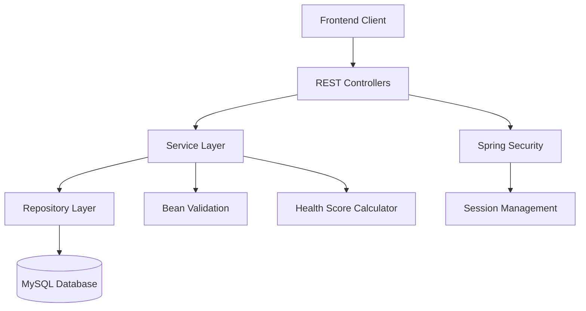

# Design Document

## Overview

This document outlines the technical design for the Health Tracker Backend API, a Spring Boot 3.5.6 application that provides comprehensive health tracking functionality with session-based authentication. The system follows a layered architecture pattern with clear separation of concerns between presentation, business logic, and data access layers.

## Architecture

### High-Level Architecture



### Layer Responsibilities

- **Controller Layer**: REST endpoint handling, request/response mapping, HTTP status management
- **Service Layer**: Business logic, validation orchestration, health score calculations
- **Repository Layer**: Data access abstraction using Spring Data JPA
- **Security Layer**: Authentication, authorization, session management
- **Entity Layer**: JPA entities representing database tables

## Components and Interfaces

### 1. Entity Models

#### User Entity
```java
@Entity
@Table(name = "users")
public class User {
    @Id @GeneratedValue(strategy = GenerationType.IDENTITY)
    private Long id;
    
    @Column(unique = true, length = 100, nullable = false)
    @Pattern(regexp = "^[a-zA-Z0-9_]{3,50}$")
    private String username;
    
    @Column(unique = true, length = 150, nullable = false)
    @Email
    private String email;
    
    @Column(length = 255, nullable = false)
    private String password; // BCrypt hashed
    
    @Column(name = "created_at", columnDefinition = "DATETIME DEFAULT CURRENT_TIMESTAMP")
    private LocalDateTime createdAt;
    
    // Relationships
    @OneToMany(mappedBy = "user", cascade = CascadeType.ALL, orphanRemoval = true)
    private List<WaterIntake> waterIntakes;
    
    @OneToMany(mappedBy = "user", cascade = CascadeType.ALL, orphanRemoval = true)
    private List<FoodIntake> foodIntakes;
    
    @OneToMany(mappedBy = "user", cascade = CascadeType.ALL, orphanRemoval = true)
    private List<Workout> workouts;
    
    @OneToMany(mappedBy = "user", cascade = CascadeType.ALL, orphanRemoval = true)
    private List<DailyHealthIndex> healthIndices;
}
```

#### WaterIntake Entity
```java
@Entity
@Table(name = "water_intake")
public class WaterIntake {
    @Id @GeneratedValue(strategy = GenerationType.IDENTITY)
    private Long id;
    
    @ManyToOne(fetch = FetchType.LAZY)
    @JoinColumn(name = "user_id", nullable = false)
    private User user;
    
    @Column(name = "amount_ltr", columnDefinition = "FLOAT(4,2)")
    @DecimalMin(value = "0.1") @DecimalMax(value = "10.0")
    private Float amountLtr;
    
    @Column(columnDefinition = "DATE DEFAULT CURRENT_DATE")
    private LocalDate date;
    
    @Column(name = "created_at", columnDefinition = "DATETIME DEFAULT CURRENT_TIMESTAMP")
    private LocalDateTime createdAt;
}
```

#### FoodIntake Entity
```java
@Entity
@Table(name = "food_intake")
public class FoodIntake {
    @Id @GeneratedValue(strategy = GenerationType.IDENTITY)
    private Long id;
    
    @ManyToOne(fetch = FetchType.LAZY)
    @JoinColumn(name = "user_id", nullable = false)
    private User user;
    
    @Column(name = "food_item", length = 100, nullable = false)
    @NotBlank @Size(min = 1, max = 100)
    private String foodItem;
    
    @Column(nullable = false)
    @Min(1) @Max(5000)
    private Integer calories;
    
    @Column(columnDefinition = "DATE DEFAULT CURRENT_DATE")
    private LocalDate date;
    
    @Column(name = "created_at", columnDefinition = "DATETIME DEFAULT CURRENT_TIMESTAMP")
    private LocalDateTime createdAt;
}
```

#### Workout Entity
```java
@Entity
@Table(name = "workouts")
public class Workout {
    @Id @GeneratedValue(strategy = GenerationType.IDENTITY)
    private Long id;
    
    @ManyToOne(fetch = FetchType.LAZY)
    @JoinColumn(name = "user_id", nullable = false)
    private User user;
    
    @Column(length = 100, nullable = false)
    @NotBlank @Size(min = 1, max = 100)
    private String activity;
    
    @Column(name = "duration_min", nullable = false)
    @Min(1) @Max(600)
    private Integer durationMin;
    
    @Column(name = "calories_burned") // NULL allowed as per schema
    @Min(0) @Max(2000)
    private Integer caloriesBurned;
    
    @Column(columnDefinition = "DATE DEFAULT CURRENT_DATE")
    private LocalDate date;
    
    @Column(name = "created_at", columnDefinition = "DATETIME DEFAULT CURRENT_TIMESTAMP")
    private LocalDateTime createdAt;
}
```

#### DailyHealthIndex Entity
```java
@Entity
@Table(name = "daily_health_index", 
       uniqueConstraints = @UniqueConstraint(columnNames = {"user_id", "date"}))
public class DailyHealthIndex {
    @Id @GeneratedValue(strategy = GenerationType.IDENTITY)
    private Long id;
    
    @ManyToOne(fetch = FetchType.LAZY)
    @JoinColumn(name = "user_id", nullable = false)
    private User user;
    
    @Column(nullable = false, columnDefinition = "DATE DEFAULT CURRENT_DATE")
    private LocalDate date;
    
    @Column(name = "health_score", columnDefinition = "FLOAT(5,2)")
    @DecimalMin("0.0") @DecimalMax("100.0")
    private Float healthScore;
    
    @Column(name = "created_at", columnDefinition = "DATETIME DEFAULT CURRENT_TIMESTAMP")
    private LocalDateTime createdAt;
}
```

### 2. Repository Interfaces

```java
public interface UserRepository extends JpaRepository<User, Long> {
    Optional<User> findByUsername(String username);
    Optional<User> findByEmail(String email);
    boolean existsByUsername(String username);
    boolean existsByEmail(String email);
}

public interface WaterIntakeRepository extends JpaRepository<WaterIntake, Long> {
    Page<WaterIntake> findByUserIdOrderByDateDesc(Long userId, Pageable pageable);
    Page<WaterIntake> findByUserIdAndDateBetweenOrderByDateDesc(Long userId, LocalDate startDate, LocalDate endDate, Pageable pageable);
    List<WaterIntake> findByUserIdAndDate(Long userId, LocalDate date);
}

public interface FoodIntakeRepository extends JpaRepository<FoodIntake, Long> {
    Page<FoodIntake> findByUserIdOrderByDateDesc(Long userId, Pageable pageable);
    Page<FoodIntake> findByUserIdAndDateBetweenOrderByDateDesc(Long userId, LocalDate startDate, LocalDate endDate, Pageable pageable);
    List<FoodIntake> findByUserIdAndDate(Long userId, LocalDate date);
}

public interface WorkoutRepository extends JpaRepository<Workout, Long> {
    Page<Workout> findByUserIdOrderByDateDesc(Long userId, Pageable pageable);
    Page<Workout> findByUserIdAndDateBetweenOrderByDateDesc(Long userId, LocalDate startDate, LocalDate endDate, Pageable pageable);
    List<Workout> findByUserIdAndDate(Long userId, LocalDate date);
}

public interface DailyHealthIndexRepository extends JpaRepository<DailyHealthIndex, Long> {
    Optional<DailyHealthIndex> findByUserIdAndDate(Long userId, LocalDate date);
}
```

### 3. Service Layer

#### AuthService
```java
@Service
public class AuthService {
    public UserResponseDto register(UserRegistrationDto registrationDto);
    public UserResponseDto login(UserLoginDto loginDto, HttpServletRequest request);
    public void logout(HttpServletRequest request);
    public UserResponseDto getCurrentUser(HttpServletRequest request);
}
```

#### HealthTrackingService
```java
@Service
public class HealthTrackingService {
    // Water intake methods
    public WaterIntakeResponseDto createWaterIntake(WaterIntakeRequestDto requestDto, Long userId);
    public Page<WaterIntakeResponseDto> getWaterIntakes(Long userId, Pageable pageable, LocalDate startDate, LocalDate endDate);
    public void deleteWaterIntake(Long id, Long userId);
    
    // Food intake methods
    public FoodIntakeResponseDto createFoodIntake(FoodIntakeRequestDto requestDto, Long userId);
    public Page<FoodIntakeResponseDto> getFoodIntakes(Long userId, Pageable pageable, LocalDate startDate, LocalDate endDate);
    public FoodIntakeResponseDto updateFoodIntake(Long id, FoodIntakeRequestDto requestDto, Long userId);
    public void deleteFoodIntake(Long id, Long userId);
    
    // Workout methods
    public WorkoutResponseDto createWorkout(WorkoutRequestDto requestDto, Long userId);
    public Page<WorkoutResponseDto> getWorkouts(Long userId, Pageable pageable, LocalDate startDate, LocalDate endDate);
    public WorkoutResponseDto updateWorkout(Long id, WorkoutRequestDto requestDto, Long userId);
    public void deleteWorkout(Long id, Long userId);
}
```

#### HealthScoreService
```java
@Service
public class HealthScoreService {
    public DailyHealthIndexResponseDto calculateHealthScore(Long userId, LocalDate date);
    public DailyHealthIndexResponseDto getHealthScore(Long userId, LocalDate date);
    
    private BigDecimal calculateWaterScore(List<WaterIntake> waterIntakes);
    private BigDecimal calculateCalorieScore(List<FoodIntake> foodIntakes);
    private BigDecimal calculateExerciseScore(List<Workout> workouts);
}
```

### 4. Controller Layer

#### AuthController
```java
@RestController
@RequestMapping("/api/auth")
public class AuthController {
    @PostMapping("/register")
    public ResponseEntity<UserResponseDto> register(@Valid @RequestBody UserRegistrationDto registrationDto);
    
    @PostMapping("/login")
    public ResponseEntity<UserResponseDto> login(@Valid @RequestBody UserLoginDto loginDto, HttpServletRequest request);
    
    @PostMapping("/logout")
    public ResponseEntity<Void> logout(HttpServletRequest request);
    
    @GetMapping("/profile")
    public ResponseEntity<UserResponseDto> getProfile(HttpServletRequest request);
}
```

#### HealthTrackingController
```java
@RestController
@RequestMapping("/api")
public class HealthTrackingController {
    // Water endpoints
    @PostMapping("/water")
    public ResponseEntity<WaterIntakeResponseDto> createWaterIntake(@Valid @RequestBody WaterIntakeRequestDto requestDto, HttpServletRequest request);
    
    @GetMapping("/water")
    public ResponseEntity<Page<WaterIntakeResponseDto>> getWaterIntakes(@RequestParam(defaultValue = "0") int page, 
                                                                        @RequestParam(defaultValue = "10") int size,
                                                                        @RequestParam(required = false) @DateTimeFormat(iso = DateTimeFormat.ISO.DATE) LocalDate startDate,
                                                                        @RequestParam(required = false) @DateTimeFormat(iso = DateTimeFormat.ISO.DATE) LocalDate endDate,
                                                                        @RequestParam(defaultValue = "date,desc") String[] sort,
                                                                        HttpServletRequest request);
    
    @DeleteMapping("/water/{id}")
    public ResponseEntity<Void> deleteWaterIntake(@PathVariable Long id, HttpServletRequest request);
    
    // Similar patterns for food and workout endpoints
    
    // Health index endpoints
    @GetMapping("/health-index")
    public ResponseEntity<DailyHealthIndexResponseDto> getCurrentHealthIndex(HttpServletRequest request);
    
    @GetMapping("/health-index/{date}")
    public ResponseEntity<DailyHealthIndexResponseDto> getHealthIndexByDate(@PathVariable @DateTimeFormat(iso = DateTimeFormat.ISO.DATE) LocalDate date, 
                                                                            HttpServletRequest request);
}
```

## Data Models

### Request/Response DTOs

#### Authentication DTOs
```java
public class UserRegistrationDto {
    @NotBlank @Size(min = 3, max = 50) @Pattern(regexp = "^[a-zA-Z0-9_]+$")
    private String username;
    
    @NotBlank @Email @Size(max = 150)
    private String email;
    
    @NotBlank @Size(min = 8) @Pattern(regexp = "^(?=.*[a-z])(?=.*[A-Z])(?=.*\\d).*$")
    private String password;
}

public class UserLoginDto {
    @NotBlank
    private String username;
    
    @NotBlank
    private String password;
}

public class UserResponseDto {
    private Long id;
    private String username;
    private String email;
    private LocalDateTime createdAt;
}
```

#### Health Tracking DTOs
```java
public class WaterIntakeRequestDto {
    @NotNull @DecimalMin("0.1") @DecimalMax("10.0")
    private Float amountLtr;
}

public class FoodIntakeRequestDto {
    @NotBlank @Size(min = 1, max = 100)
    private String foodItem;
    
    @NotNull @Min(1) @Max(5000)
    private Integer calories;
}

public class WorkoutRequestDto {
    @NotBlank @Size(min = 1, max = 100)
    private String activity;
    
    @NotNull @Min(1) @Max(600)
    private Integer durationMin;
    
    @Min(0) @Max(2000)
    private Integer caloriesBurned;
}
```

## Error Handling

### Global Exception Handler
```java
@RestControllerAdvice
public class GlobalExceptionHandler {
    
    @ExceptionHandler(MethodArgumentNotValidException.class)
    public ResponseEntity<ErrorResponse> handleValidationExceptions(MethodArgumentNotValidException ex);
    
    @ExceptionHandler(ResourceNotFoundException.class)
    public ResponseEntity<ErrorResponse> handleResourceNotFound(ResourceNotFoundException ex);
    
    @ExceptionHandler(UnauthorizedException.class)
    public ResponseEntity<ErrorResponse> handleUnauthorized(UnauthorizedException ex);
    
    @ExceptionHandler(ConflictException.class)
    public ResponseEntity<ErrorResponse> handleConflict(ConflictException ex);
    
    @ExceptionHandler(Exception.class)
    public ResponseEntity<ErrorResponse> handleGenericException(Exception ex);
}
```

### Custom Exception Classes
```java
public class ResourceNotFoundException extends RuntimeException {
    public ResourceNotFoundException(String message) { super(message); }
}

public class UnauthorizedException extends RuntimeException {
    public UnauthorizedException(String message) { super(message); }
}

public class ConflictException extends RuntimeException {
    public ConflictException(String message) { super(message); }
}
```

## Testing Strategy

### Unit Testing
- **Service Layer Tests**: Mock repositories, test business logic and calculations
- **Repository Tests**: Use @DataJpaTest for database interaction testing
- **Controller Tests**: Use @WebMvcTest for endpoint testing with mocked services
- **Security Tests**: Test authentication and authorization scenarios

### Integration Testing
- **Full Stack Tests**: Use @SpringBootTest for complete application testing
- **Database Integration**: Test with TestContainers for MySQL
- **Session Management**: Test session creation, validation, and expiration

### Test Coverage Goals
- Minimum 80% code coverage
- 100% coverage for critical business logic (health score calculation)
- All error scenarios covered

## Security Configuration

### Spring Security Configuration
```java
@Configuration
@EnableWebSecurity
public class SecurityConfig {
    
    @Bean
    public SecurityFilterChain filterChain(HttpSecurity http) throws Exception {
        return http
            .csrf(csrf -> csrf.csrfTokenRepository(CookieCsrfTokenRepository.withHttpOnlyFalse()))
            .sessionManagement(session -> session
                .sessionCreationPolicy(SessionCreationPolicy.IF_REQUIRED)
                .maximumSessions(1)
                .maxSessionsPreventsLogin(false))
            .authorizeHttpRequests(auth -> auth
                .requestMatchers("/api/auth/register", "/api/auth/login").permitAll()
                .anyRequest().authenticated())
            .build();
    }
    
    @Bean
    public PasswordEncoder passwordEncoder() {
        return new BCryptPasswordEncoder(12);
    }
}
```

### Session Configuration
```java
@Configuration
public class SessionConfig {
    
    @Bean
    public HttpSessionEventPublisher httpSessionEventPublisher() {
        return new HttpSessionEventPublisher();
    }
}
```

## Performance Considerations

### Database Optimization
- Proper indexing on foreign keys and frequently queried columns
- Pagination for all list endpoints to prevent large result sets
- Lazy loading for entity relationships
- Connection pooling configuration

### Caching Strategy
- Cache daily health scores for frequently accessed dates
- Session caching for authentication state
- Consider Redis for distributed session storage in production

### API Performance
- Use DTOs to control data transfer size
- Implement proper HTTP caching headers
- Compress responses for large datasets