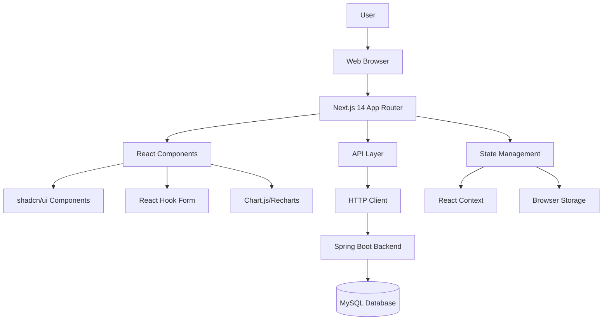

# Design Document

## Overview

This document outlines the technical design for the Health Tracker Frontend application, a modern Next.js 14 application with TypeScript, Tailwind CSS, and shadcn/ui components. The frontend will provide a responsive, accessible interface for health tracking that seamlessly integrates with the existing Spring Boot backend API through session-based authentication and RESTful endpoints.

## Architecture

### High-Level Architecture



### Technology Stack

- **Framework**: Next.js 14 with App Router
- **Language**: TypeScript
- **Styling**: Tailwind CSS v4
- **UI Components**: shadcn/ui (Radix UI primitives)
- **Forms**: React Hook Form with Zod validation
- **HTTP Client**: Fetch API with custom wrapper
- **Charts**: Recharts for data visualization
- **State Management**: React Context + useReducer
- **Icons**: Lucide React
- **Animations**: Framer Motion (optional)

## Components and Interfaces

### 1. Project Structure

```
ht-frontend/
├── app/
│   ├── (auth)/
│   │   ├── login/
│   │   │   └── page.tsx
│   │   └── register/
│   │       └── page.tsx
│   ├── (dashboard)/
│   │   ├── dashboard/
│   │   │   └── page.tsx
│   │   ├── water/
│   │   │   └── page.tsx
│   │   ├── food/
│   │   │   └── page.tsx
│   │   ├── workouts/
│   │   │   └── page.tsx
│   │   └── health-score/
│   │       └── page.tsx
│   ├── globals.css
│   ├── layout.tsx
│   └── page.tsx (Landing)
├── components/
│   ├── ui/ (shadcn/ui components)
│   ├── auth/
│   ├── dashboard/
│   ├── forms/
│   ├── charts/
│   └── layout/
├── lib/
│   ├── api/
│   ├── auth/
│   ├── utils/
│   ├── validations/
│   └── types/
├── hooks/
├── contexts/
└── public/
```

### 2. Core Components Architecture

#### Layout Components
```typescript
// components/layout/AppLayout.tsx
interface AppLayoutProps {
  children: React.ReactNode;
  showSidebar?: boolean;
}

// components/layout/Sidebar.tsx
interface SidebarProps {
  isOpen: boolean;
  onClose: () => void;
}

// components/layout/Header.tsx
interface HeaderProps {
  user?: User;
  onLogout: () => void;
}
```

#### Authentication Components
```typescript
// components/auth/LoginForm.tsx
interface LoginFormProps {
  onSuccess: (user: User) => void;
  onError: (error: string) => void;
}

// components/auth/RegisterForm.tsx
interface RegisterFormProps {
  onSuccess: (user: User) => void;
  onError: (error: string) => void;
}

// components/auth/AuthGuard.tsx
interface AuthGuardProps {
  children: React.ReactNode;
  fallback?: React.ReactNode;
}
```

#### Health Tracking Components
```typescript
// components/dashboard/HealthScoreCard.tsx
interface HealthScoreCardProps {
  score: number;
  breakdown: {
    water: number;
    food: number;
    exercise: number;
  };
  date: string;
}

// components/forms/WaterIntakeForm.tsx
interface WaterIntakeFormProps {
  onSubmit: (data: WaterIntakeRequest) => Promise<void>;
  initialData?: WaterIntake;
}

// components/forms/FoodIntakeForm.tsx
interface FoodIntakeFormProps {
  onSubmit: (data: FoodIntakeRequest) => Promise<void>;
  initialData?: FoodIntake;
  mode: 'create' | 'edit';
}

// components/forms/WorkoutForm.tsx
interface WorkoutFormProps {
  onSubmit: (data: WorkoutRequest) => Promise<void>;
  initialData?: Workout;
  mode: 'create' | 'edit';
}
```

### 3. Data Models and Types

#### API Response Types
```typescript
// lib/types/api.ts
interface ApiResponse<T> {
  data?: T;
  error?: string;
  status: number;
}

interface PaginatedResponse<T> {
  content: T[];
  page: {
    number: number;
    size: number;
    totalElements: number;
    totalPages: number;
  };
}

interface ErrorResponse {
  timestamp: string;
  status: number;
  error: string;
  message: string;
  details?: Array<{
    field: string;
    message: string;
  }>;
  path: string;
}
```

#### User and Authentication Types
```typescript
// lib/types/auth.ts
interface User {
  id: number;
  username: string;
  email: string;
  createdAt: string;
}

interface LoginRequest {
  username: string;
  password: string;
}

interface RegisterRequest {
  username: string;
  email: string;
  password: string;
}

interface AuthState {
  user: User | null;
  isAuthenticated: boolean;
  isLoading: boolean;
  error: string | null;
}
```

#### Health Tracking Types
```typescript
// lib/types/health.ts
interface WaterIntake {
  id: number;
  amountLtr: number;
  date: string;
  createdAt: string;
}

interface WaterIntakeRequest {
  amountLtr: number;
}

interface FoodIntake {
  id: number;
  foodItem: string;
  calories: number;
  date: string;
  createdAt: string;
}

interface FoodIntakeRequest {
  foodItem: string;
  calories: number;
}

interface Workout {
  id: number;
  activity: string;
  durationMin: number;
  caloriesBurned?: number;
  date: string;
  createdAt: string;
}

interface WorkoutRequest {
  activity: string;
  durationMin: number;
  caloriesBurned?: number;
}

interface DailyHealthIndex {
  id: number;
  date: string;
  healthScore: number;
  createdAt: string;
}
```

### 4. API Integration Layer

#### HTTP Client Configuration
```typescript
// lib/api/client.ts
class ApiClient {
  private baseURL: string;
  private defaultHeaders: Record<string, string>;

  constructor(baseURL: string) {
    this.baseURL = baseURL;
    this.defaultHeaders = {
      'Content-Type': 'application/json',
    };
  }

  async request<T>(
    endpoint: string,
    options: RequestInit = {}
  ): Promise<ApiResponse<T>> {
    // Implementation with error handling, CSRF token, and session management
  }

  async get<T>(endpoint: string): Promise<ApiResponse<T>>;
  async post<T>(endpoint: string, data: any): Promise<ApiResponse<T>>;
  async put<T>(endpoint: string, data: any): Promise<ApiResponse<T>>;
  async delete<T>(endpoint: string): Promise<ApiResponse<T>>;
}
```

#### API Service Classes
```typescript
// lib/api/auth.ts
export class AuthService {
  static async register(data: RegisterRequest): Promise<ApiResponse<User>>;
  static async login(data: LoginRequest): Promise<ApiResponse<User>>;
  static async logout(): Promise<ApiResponse<void>>;
  static async getProfile(): Promise<ApiResponse<User>>;
}

// lib/api/health.ts
export class HealthService {
  // Water intake methods
  static async createWaterIntake(data: WaterIntakeRequest): Promise<ApiResponse<WaterIntake>>;
  static async getWaterIntakes(params: PaginationParams): Promise<ApiResponse<PaginatedResponse<WaterIntake>>>;
  static async deleteWaterIntake(id: number): Promise<ApiResponse<void>>;

  // Food intake methods
  static async createFoodIntake(data: FoodIntakeRequest): Promise<ApiResponse<FoodIntake>>;
  static async getFoodIntakes(params: PaginationParams): Promise<ApiResponse<PaginatedResponse<FoodIntake>>>;
  static async updateFoodIntake(id: number, data: FoodIntakeRequest): Promise<ApiResponse<FoodIntake>>;
  static async deleteFoodIntake(id: number): Promise<ApiResponse<void>>;

  // Workout methods
  static async createWorkout(data: WorkoutRequest): Promise<ApiResponse<Workout>>;
  static async getWorkouts(params: PaginationParams): Promise<ApiResponse<PaginatedResponse<Workout>>>;
  static async updateWorkout(id: number, data: WorkoutRequest): Promise<ApiResponse<Workout>>;
  static async deleteWorkout(id: number): Promise<ApiResponse<void>>;

  // Health score methods
  static async getCurrentHealthScore(): Promise<ApiResponse<DailyHealthIndex>>;
  static async getHealthScoreByDate(date: string): Promise<ApiResponse<DailyHealthIndex>>;
}
```

### 5. State Management

#### Authentication Context
```typescript
// contexts/AuthContext.tsx
interface AuthContextType {
  state: AuthState;
  login: (credentials: LoginRequest) => Promise<void>;
  register: (data: RegisterRequest) => Promise<void>;
  logout: () => Promise<void>;
  refreshUser: () => Promise<void>;
}

const AuthContext = createContext<AuthContextType | undefined>(undefined);

export function AuthProvider({ children }: { children: React.ReactNode }) {
  const [state, dispatch] = useReducer(authReducer, initialAuthState);
  // Implementation
}
```

#### Health Data Context
```typescript
// contexts/HealthContext.tsx
interface HealthContextType {
  waterIntakes: WaterIntake[];
  foodIntakes: FoodIntake[];
  workouts: Workout[];
  healthScore: DailyHealthIndex | null;
  isLoading: boolean;
  error: string | null;
  
  // Actions
  addWaterIntake: (data: WaterIntakeRequest) => Promise<void>;
  deleteWaterIntake: (id: number) => Promise<void>;
  addFoodIntake: (data: FoodIntakeRequest) => Promise<void>;
  updateFoodIntake: (id: number, data: FoodIntakeRequest) => Promise<void>;
  deleteFoodIntake: (id: number) => Promise<void>;
  addWorkout: (data: WorkoutRequest) => Promise<void>;
  updateWorkout: (id: number, data: WorkoutRequest) => Promise<void>;
  deleteWorkout: (id: number) => Promise<void>;
  refreshHealthScore: () => Promise<void>;
}
```

## Data Models

### Form Validation Schemas

```typescript
// lib/validations/auth.ts
import { z } from 'zod';

export const loginSchema = z.object({
  username: z.string().min(1, 'Username is required'),
  password: z.string().min(1, 'Password is required'),
});

export const registerSchema = z.object({
  username: z
    .string()
    .min(3, 'Username must be at least 3 characters')
    .max(50, 'Username must be less than 50 characters')
    .regex(/^[a-zA-Z0-9_]+$/, 'Username can only contain letters, numbers, and underscores'),
  email: z
    .string()
    .email('Invalid email format')
    .max(150, 'Email must be less than 150 characters'),
  password: z
    .string()
    .min(8, 'Password must be at least 8 characters')
    .regex(/^(?=.*[a-z])(?=.*[A-Z])(?=.*\d).*$/, 'Password must contain at least one uppercase letter, one lowercase letter, and one number'),
});

// lib/validations/health.ts
export const waterIntakeSchema = z.object({
  amountLtr: z
    .number()
    .min(0.1, 'Amount must be at least 0.1 liters')
    .max(10.0, 'Amount must be less than 10.0 liters'),
});

export const foodIntakeSchema = z.object({
  foodItem: z
    .string()
    .min(1, 'Food item is required')
    .max(100, 'Food item must be less than 100 characters'),
  calories: z
    .number()
    .min(1, 'Calories must be at least 1')
    .max(5000, 'Calories must be less than 5000'),
});

export const workoutSchema = z.object({
  activity: z
    .string()
    .min(1, 'Activity is required')
    .max(100, 'Activity must be less than 100 characters'),
  durationMin: z
    .number()
    .min(1, 'Duration must be at least 1 minute')
    .max(600, 'Duration must be less than 600 minutes'),
  caloriesBurned: z
    .number()
    .min(0, 'Calories burned cannot be negative')
    .max(2000, 'Calories burned must be less than 2000')
    .optional(),
});
```

## Error Handling

### Error Handling Strategy

```typescript
// lib/utils/error-handler.ts
export class ApiError extends Error {
  constructor(
    public status: number,
    public message: string,
    public details?: Array<{ field: string; message: string }>
  ) {
    super(message);
    this.name = 'ApiError';
  }
}

export function handleApiError(error: unknown): ApiError {
  if (error instanceof ApiError) {
    return error;
  }
  
  if (error instanceof Error) {
    return new ApiError(500, error.message);
  }
  
  return new ApiError(500, 'An unexpected error occurred');
}

// components/ui/ErrorBoundary.tsx
interface ErrorBoundaryState {
  hasError: boolean;
  error?: Error;
}

export class ErrorBoundary extends Component<
  { children: ReactNode; fallback?: ReactNode },
  ErrorBoundaryState
> {
  // Implementation for catching React errors
}
```

### Form Error Handling

```typescript
// hooks/useFormError.ts
export function useFormError() {
  const [errors, setErrors] = useState<Record<string, string>>({});

  const setFieldError = (field: string, message: string) => {
    setErrors(prev => ({ ...prev, [field]: message }));
  };

  const clearFieldError = (field: string) => {
    setErrors(prev => {
      const newErrors = { ...prev };
      delete newErrors[field];
      return newErrors;
    });
  };

  const setApiErrors = (apiError: ApiError) => {
    if (apiError.details) {
      const fieldErrors = apiError.details.reduce((acc, detail) => {
        acc[detail.field] = detail.message;
        return acc;
      }, {} as Record<string, string>);
      setErrors(fieldErrors);
    }
  };

  return { errors, setFieldError, clearFieldError, setApiErrors, clearErrors: () => setErrors({}) };
}
```

## Testing Strategy

### Component Testing
```typescript
// __tests__/components/LoginForm.test.tsx
import { render, screen, fireEvent, waitFor } from '@testing-library/react';
import { LoginForm } from '@/components/auth/LoginForm';

describe('LoginForm', () => {
  it('should validate required fields', async () => {
    render(<LoginForm onSuccess={jest.fn()} onError={jest.fn()} />);
    
    fireEvent.click(screen.getByRole('button', { name: /login/i }));
    
    await waitFor(() => {
      expect(screen.getByText('Username is required')).toBeInTheDocument();
      expect(screen.getByText('Password is required')).toBeInTheDocument();
    });
  });

  it('should call onSuccess when login is successful', async () => {
    const mockOnSuccess = jest.fn();
    // Test implementation
  });
});
```

### API Testing
```typescript
// __tests__/api/auth.test.ts
import { AuthService } from '@/lib/api/auth';

describe('AuthService', () => {
  beforeEach(() => {
    fetchMock.resetMocks();
  });

  it('should login successfully with valid credentials', async () => {
    fetchMock.mockResponseOnce(JSON.stringify({ 
      id: 1, 
      username: 'testuser', 
      email: 'test@example.com' 
    }));

    const result = await AuthService.login({ 
      username: 'testuser', 
      password: 'password123' 
    });

    expect(result.data).toBeDefined();
    expect(result.data?.username).toBe('testuser');
  });
});
```

### Integration Testing
```typescript
// __tests__/integration/auth-flow.test.tsx
import { render, screen, fireEvent, waitFor } from '@testing-library/react';
import { AuthProvider } from '@/contexts/AuthContext';
import App from '@/app/page';

describe('Authentication Flow', () => {
  it('should complete full registration and login flow', async () => {
    // Test complete user journey
  });
});
```

## Performance Considerations

### Code Splitting and Lazy Loading
```typescript
// Dynamic imports for route-based code splitting
const Dashboard = dynamic(() => import('@/app/(dashboard)/dashboard/page'), {
  loading: () => <DashboardSkeleton />,
});

const WaterTracking = dynamic(() => import('@/app/(dashboard)/water/page'), {
  loading: () => <PageSkeleton />,
});
```

### Data Fetching Optimization
```typescript
// hooks/useHealthData.ts
export function useHealthData() {
  const [data, setData] = useState<HealthData | null>(null);
  const [isLoading, setIsLoading] = useState(true);

  // Implement SWR-like caching and revalidation
  const fetchData = useCallback(async () => {
    // Fetch with caching strategy
  }, []);

  // Optimistic updates for better UX
  const optimisticUpdate = useCallback((updateFn: (data: HealthData) => HealthData) => {
    setData(prev => prev ? updateFn(prev) : null);
  }, []);

  return { data, isLoading, fetchData, optimisticUpdate };
}
```

### Image and Asset Optimization
- Use Next.js Image component for automatic optimization
- Implement proper loading states and skeleton screens
- Optimize bundle size with tree shaking and dynamic imports

## Security Configuration

### CORS Configuration for Backend
```java
// Add to SecurityConfig.java
@Bean
public CorsConfigurationSource corsConfigurationSource() {
    CorsConfiguration configuration = new CorsConfiguration();
    configuration.setAllowedOriginPatterns(Arrays.asList(
        "http://localhost:3000",
        "https://*.vercel.app",
        "https://yourdomain.com"
    ));
    configuration.setAllowedMethods(Arrays.asList("GET", "POST", "PUT", "DELETE", "OPTIONS"));
    configuration.setAllowedHeaders(Arrays.asList("*"));
    configuration.setAllowCredentials(true);
    configuration.setMaxAge(3600L);
    
    UrlBasedCorsConfigurationSource source = new UrlBasedCorsConfigurationSource();
    source.registerCorsConfiguration("/api/**", configuration);
    return source;
}
```

### Frontend Security Measures
```typescript
// lib/utils/security.ts
export function sanitizeInput(input: string): string {
  // Implement input sanitization
  return input.trim().replace(/[<>]/g, '');
}

export function validateCSRFToken(): boolean {
  // Implement CSRF token validation
  const token = document.querySelector('meta[name="csrf-token"]')?.getAttribute('content');
  return !!token;
}

// Secure storage utilities
export const secureStorage = {
  setItem: (key: string, value: string) => {
    // Use secure storage methods
    sessionStorage.setItem(key, value);
  },
  getItem: (key: string) => {
    return sessionStorage.getItem(key);
  },
  removeItem: (key: string) => {
    sessionStorage.removeItem(key);
  },
};
```

## Responsive Design Strategy

### Breakpoint System
```typescript
// lib/utils/breakpoints.ts
export const breakpoints = {
  sm: '640px',
  md: '768px',
  lg: '1024px',
  xl: '1280px',
  '2xl': '1536px',
} as const;

// Tailwind CSS configuration will use these breakpoints
```

### Mobile-First Component Design
```typescript
// components/layout/ResponsiveLayout.tsx
export function ResponsiveLayout({ children }: { children: React.ReactNode }) {
  const [isMobile, setIsMobile] = useState(false);

  useEffect(() => {
    const checkMobile = () => {
      setIsMobile(window.innerWidth < 768);
    };
    
    checkMobile();
    window.addEventListener('resize', checkMobile);
    return () => window.removeEventListener('resize', checkMobile);
  }, []);

  return (
    <div className="min-h-screen bg-background">
      {isMobile ? <MobileLayout>{children}</MobileLayout> : <DesktopLayout>{children}</DesktopLayout>}
    </div>
  );
}
```

## Accessibility Features

### ARIA Labels and Semantic HTML
```typescript
// components/ui/Button.tsx
interface ButtonProps extends React.ButtonHTMLAttributes<HTMLButtonElement> {
  variant?: 'primary' | 'secondary' | 'destructive';
  size?: 'sm' | 'md' | 'lg';
  isLoading?: boolean;
}

export function Button({ 
  children, 
  variant = 'primary', 
  size = 'md', 
  isLoading = false,
  disabled,
  ...props 
}: ButtonProps) {
  return (
    <button
      className={cn(buttonVariants({ variant, size }))}
      disabled={disabled || isLoading}
      aria-disabled={disabled || isLoading}
      {...props}
    >
      {isLoading && <Spinner className="mr-2 h-4 w-4" aria-hidden="true" />}
      {children}
    </button>
  );
}
```

### Keyboard Navigation
```typescript
// hooks/useKeyboardNavigation.ts
export function useKeyboardNavigation(items: string[], onSelect: (item: string) => void) {
  const [selectedIndex, setSelectedIndex] = useState(0);

  useEffect(() => {
    const handleKeyDown = (event: KeyboardEvent) => {
      switch (event.key) {
        case 'ArrowDown':
          event.preventDefault();
          setSelectedIndex(prev => (prev + 1) % items.length);
          break;
        case 'ArrowUp':
          event.preventDefault();
          setSelectedIndex(prev => (prev - 1 + items.length) % items.length);
          break;
        case 'Enter':
          event.preventDefault();
          onSelect(items[selectedIndex]);
          break;
      }
    };

    document.addEventListener('keydown', handleKeyDown);
    return () => document.removeEventListener('keydown', handleKeyDown);
  }, [items, selectedIndex, onSelect]);

  return selectedIndex;
}
```